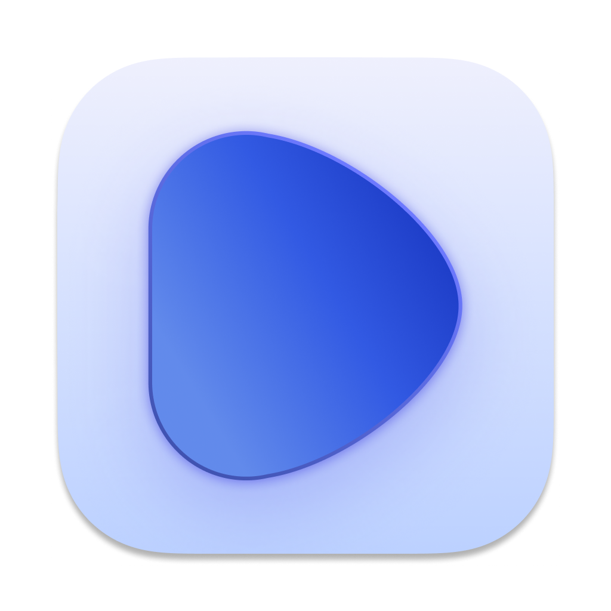

<p align="center">
  
</p>

<h1 align="center">Dash</h1>

<p align="center">
  <strong>Private notes app. No cloud, no tracking, your data stays on your device.</strong>
</p>

<p align="center">
  <a href="https://dashnote.io">Website</a> &middot;
  <a href="https://github.com/Efesop/rich-text-editor/releases">Releases</a> &middot;
  <a href="./FEATURES.md">Features</a> &middot;
  <a href="./CHANGELOG.md">Changelog</a>
</p>

---

## What is Dash?

Dash is a privacy-first, offline-first note-taking app. Everything is stored locally on your device with AES-256 encryption — no telemetry, no tracking, no ads. Optional end-to-end-encrypted sync (Dash Sync subscription) is the only thing that ever reaches a server, and even then only as ciphertext.

**Get it at [dashnote.io](https://dashnote.io)**

### Highlights

- **Offline-First** - Works fully without internet. Nothing leaves your device unless you opt into encrypted sync.
- **AES-256 Encryption** - Lock individual notes or the entire app with password protection.
- **Rich Editor** - 15+ block types: headers, lists, code, tables, images, embeds, seed phrase storage, and more.
- **Page Linking** - Type `[[` to create wiki-style links between pages, or highlight text and link via the toolbar.
- **4 Themes** - Light, Dark, Night, and Terminal, or match your system's light/dark setting.
- **Folders & Tags** - Organize with drag-and-drop folders and color-coded tags.
- **Quick Switcher** - Cmd+P to jump to any note instantly.
- **Self-Destructing Notes** - Set notes to auto-delete after a time period.
- **Duress Password** - A secondary password that silently shows decoy notes under coercion (real data stays encrypted on disk).
- **Seed Phrase Storage** - Secure numbered grid for crypto wallet recovery phrases with BIP-39 validation.
- **Touch ID & Face ID** - Biometric unlock on macOS and iOS.
- **Built for iPhone** - Full-width notes screen with swipe to trash or lock, plus a native App Store app.
- **Focus Mode** - Distraction-free writing with typewriter scrolling, paragraph dimming, and session stats.
- **Export Anywhere** - PDF, Markdown, Word, RTF, JSON, XML, CSV. All optionally encrypted.
- **Dash Sync (optional)** - End-to-end-encrypted sync across Mac, iPhone, iPad, and the web. Subscription-based; the relay only ever sees ciphertext.

See [FEATURES.md](./FEATURES.md) for the full feature list.

## Platforms

| Platform | Method |
|----------|--------|
| **macOS** | Native app ([download](https://dashnote.io)) |
| **iOS** | Native app ([App Store](https://apps.apple.com/app/id6766192836)) |
| **Browser / PWA** | [Web version](https://efesop.github.io/rich-text-editor/) |

## Pricing

- **macOS app** — $14.99 one-time (lifetime updates).
- **Dash Sync** — optional subscription for end-to-end-encrypted multi-device sync: $4.99/mo or $47.99/yr, with a 7-day free trial. Dash is fully functional offline without it.

## Tech Stack

Next.js 13, React 18, Editor.js, Electron, Tailwind CSS, Zustand, @dnd-kit, WebCrypto API.

See [ARCHITECTURE.md](./ARCHITECTURE.md) for technical details.

## Development

```bash
npm install
npm run dev            # Web dev server (localhost:3000)
npm run electron-dev   # Desktop app dev mode
```

## Contributing

Contributions welcome. Please open an issue first to discuss what you'd like to change.

1. Fork the repo
2. Create a feature branch
3. Make your changes
4. Open a Pull Request

## License

[MIT](./LICENSE) - Filmshape Ltd
